# Incident Timeline - Case 2512120040008759 (Desjardins)

**Incident:** Purview DLP classification timeouts causing enforcement gaps  
**Duration:** December 13, 2025 - January 30, 2026 (54 days)  
**Customer:** Desjardins  

---

## Visual Timeline

```mermaid
timeline
    title Desjardins Purview DLP Incident Timeline (Case 2512120040008759)
    
    2025-12-13 : Case 2512120040008759 created as Sev B : CSS acknowledges case and requests logs
    
    2025-12-15 : Customer requests Sev A escalation : Multiple logs exchanged
    
    2025-12-16 : ICM 723169126 created (Sev 3) - 3 days after case : EEE Sarah Saftel engaged
    
    2025-12-17 : ICM raised to Sev 25 (41 hours delay) : Support case lifted to Sev A
    
    2025-12-18 : SRE Shravan Allampally acknowledges
    
    2025-12-19 : PG provides initial technical analysis : ICM mitigated to Sev 3 : ICM reactivated 8 hours later
    
    2025-12-20 : ICM escalated back to Sev 25
    
    2025-12-22 : PG identifies classification timeout root cause : Recommends SIT optimization
    
    2025-12-23-26 : **GAP 1 - Holiday communication gap** : No technical updates to customer : Only CritSit Manager updates sent
    
    2025-12-29 : Customer finally receives PG updates from Dec 22 : 7-day communication delay
    
    2026-01-06 : ICM 21000000837036 created (Sev 3) : Replication testing issue
    
    2026-01-07 : **GAP 2 - Communication confusion** : Contradictory support messages sent : Customer receives conflicting information
    
    2026-01-09-11 : **GAP 4 - No PG response** : Extended silence while at Sev 25/2 : Customer waiting for clarity
    
    2026-01-12 : PG identifies classification timeout : Mansi Mishra concludes DPS completed but scan timed out : Vipul Yadav recommends RetryThenBlock setting
    
    2026-01-12 : **GAP 5 - Classification team not yet engaged** : Issue identified but specialist team not brought in
    
    2026-01-13 : Customer rejects RetryThenBlock as scale solution : Requests RCA for timeouts : Secure-By-Default discussed (private preview)
    
    2026-01-13-17 : **GAP 6 - 4 days no PG response** : ICM remains at Sev 2 with no updates
    
    2026-01-14 : ICM 21000000837036 moved to Sev 25 : 1 day post-mitigation escalation
    
    2026-01-15 : ICM 21000000837036 escalated to Sev 2 : CFL raised - Highly critical escalation : **GAP 3 - No Engineering bridge created** : Customer rejects Secure-By-Default : Unacceptable business impact and visibility concerns
    
    2026-01-16 : ICM 21000000859258 created for Classification team : **Should have been earlier** : PG Simon Yang acknowledges : Customer and support align on findings
    
    2026-01-17 : PG Jovin Raj provides clarity on all questions : Classification PG Tushar Goyal confirms inefficient regex : Unlimited proximity settings identified
    
    2026-01-18 : **GAP 7 - Incorrect initial analysis** : Wrong tenant SIT shared (728d20a5) : Corrected list provided - 1 day delay
    
    2026-01-19 : PG Amal confirms analysis complete : Customer to proceed with SIT optimizations
    
    2026-01-20 : CISO confidence call : CAT (Maithili Victor Rupesh) aligned : Agreement on priorities
    
    2026-01-21 : CAT supports PG/CSS interpretation : Focus on text extraction limits and SIT impacts
    
    2026-01-24 : Deep-dive workshop with operational team : PG agrees to flight Secure by Default preview
    
    2026-01-26 : Customer Sr.Director escalates to CSAM : Dissatisfaction with progress and ownership
    
    2026-01-27 : Customer LT account teams CxE/CAT align : **BREAKTHROUGH** Legacy 100K unique-SIT exception discovered : Exception removed immediately at 5 PM ET
    
    2026-01-27 : DLP PG team analyzes 10 days of data : Timeouts drop on weekends : Marginal weekday improvement post-SIT removal
    
    2026-01-28 : CAT + customer review telemetry : Secure by Default preview now available : Rules configured for new preview
    
    2026-01-29 : CAT CSS customer review telemetry : Interim improvements observed : Secure-By-Default discussed as mitigation
    
    2026-01-30 : Case downgraded to Sev B : Customer agrees to optimize SITs with CAT : Awaiting classification timeout telemetry
```

---

## Key Timeline Metrics

### Duration Analysis
- **Total Incident Duration:** 54 days (Dec 13, 2025 - Jan 30, 2026)
- **Time to ICM Creation:** 3 days
- **Time to Sev 25 Escalation:** 4.7 days (41 hours after ICM creation)
- **Time to First PG Analysis:** 3.6 days after ICM creation
- **Time to Root Cause:** 30 days
- **Time to Breakthrough Discovery:** 45 days (hidden 100K exception)
- **Time to Resolution:** 54 days

### Communication Gaps
1. **Gap 1 (Dec 23-29):** 7-day holiday communication gap - No technical updates
2. **Gap 2 (Jan 7):** Contradictory support messages to customer
3. **Gap 3 (Jan 15):** No engineering bridge despite CFL escalation
4. **Gap 4 (Jan 9-11):** Extended PG silence at Sev 25/2
5. **Gap 5 (Jan 12):** Classification specialist team not engaged when needed
6. **Gap 6 (Jan 13-17):** 4 days without PG response at Sev 2
7. **Gap 7 (Jan 18):** Incorrect tenant SIT analysis provided

### Critical Path Events
- **Dec 16:** ICM created (delayed 3 days)
- **Dec 17:** Severity raised to 25 (delayed 41 hours)
- **Dec 22:** Root cause identified (classification timeout)
- **Jan 12:** PG confirms timeout, recommends workaround
- **Jan 15:** Customer escalates, rejects workarounds (CFL raised)
- **Jan 16:** Classification team finally engaged (should have been earlier)
- **Jan 27:** **Breakthrough** - Hidden 100K exception discovered and removed
- **Jan 30:** Case downgraded to Sev B

---

## Phase Breakdown

### Phase 1: Initial Investigation (Dec 13-16) - 3 days
- Case created as Sev B
- CSS gathers logs and attempts reproduction
- Customer requests escalation to Sev A
- ICM created on Day 3

### Phase 2: First PG Engagement (Dec 16-22) - 6 days
- ICM severity raised from 3 → 25 → 3 → 25 (volatile)
- Initial PG analysis identifies classification timeout
- SIT optimization recommendations provided
- Support case escalated to Sev A

### Phase 3: Holiday Communication Gap (Dec 23-29) - 7 days
- **61% waste identified** - Only CritSit Manager updates
- No substantive technical communication to customer
- PG findings not relayed to customer

### Phase 4: Customer Pushback (Jan 1-15) - 15 days
- Customer rejects RetryThenBlock as workaround
- Customer rejects Secure-By-Default (business impact concerns)
- Multiple ICMs created, escalated to Sev 2
- CFL raised but no engineering bridge created

### Phase 5: Deep Dive & Discovery (Jan 16-27) - 12 days
- Classification team finally engaged
- Multiple technical deep-dives with customer
- Incorrect SIT analysis corrected
- **Jan 27 Breakthrough:** Hidden 100K exception discovered

### Phase 6: Resolution Path (Jan 28-30) - 3 days
- Exception removed, telemetry monitored
- Secure-By-Default preview enabled
- Customer agrees to SIT optimization
- Case downgraded to Sev B

---

## Impact Summary

### Waste Analysis
- **33 days of 54 = 61% waste** (waiting, communication gaps, rework)
- **21 days of 54 = 39% value-add** (actual investigation and resolution)

### Major Delays
1. **21 days waiting on PG** (multiple communication gaps)
2. **7 days holiday gap** (no technical updates)
3. **3 days to create ICM** (delayed escalation)
4. **45 days to discover root cause** (hidden 100K exception)

### Customer Satisfaction Impact
- Multiple escalations to Senior Leadership (Sr.Director → CSAM)
- Loss of confidence in support and engineering
- Forced to reject multiple mitigation attempts
- Business critical issue remained unresolved for 54 days

---

## Lessons Learned

### What Went Wrong
1. **Delayed ICM Creation:** 3 days delay in escalating to PG
2. **Delayed Sev Escalation:** 41 hours to raise ICM from Sev 3 to 25
3. **Holiday Coverage Gap:** 7 days without technical updates
4. **Delayed Specialist Engagement:** Classification team engaged too late
5. **Multiple Communication Failures:** 7 identified communication gaps
6. **Incorrect Analysis:** Wrong tenant SIT shared, causing delays
7. **Hidden Root Cause:** 100K exception not discovered until Day 45

### What Went Right
1. **CAT Engagement:** Critical in breakthrough discovery
2. **Customer Persistence:** Drove accountability and resolution
3. **Cross-team Collaboration:** Eventually led to discovery
4. **Telemetry Analysis:** Identified weekend timeout patterns
5. **Immediate Action:** Exception removed within hours of discovery

### Preventive Measures
1. Automated SLA violation alerts for ICM creation
2. Holiday coverage protocols with mandatory technical updates
3. Early specialist team engagement for known issue types
4. Enhanced tenant validation and exception visibility
5. Engineering bridges for all CFL escalations
6. Expanded severity criteria to catch classification issues earlier

---

*For detailed Gemba/CI analysis and recommendations, see: [GEMBA_ANALYSIS_2512120040008759_Desjardins.md](GEMBA_ANALYSIS_2512120040008759_Desjardins.md)*
