# Incident Timeline - Case 2512120040008759 (Desjardins)

**Incident:** Purview DLP classification timeouts causing enforcement gaps  
**Duration:** December 13, 2025 - January 30, 2026 (48 days)  
**Customer:** Desjardins  
**ICMs:** 3 (723169126, 21000000837036, 21000000859258)

---

## 📊 Executive Metrics Dashboard

| Days to Close | Customer Touchpoints | Max Duration w/o Update | ICMs Created | Internal Personnel |
|:-------------:|:-------------------:|:----------------------:|:------------:|:------------------:|
| **48 days** | **27** | **7 days*** | **3** | **18** |

*Gap 1: Holiday communication gap (Dec 23-29)

---

## 📅 Visual Timeline

```mermaid
timeline
    title Desjardins Purview DLP Incident Timeline (Case 2512120040008759)
    
    section Initial Investigation (9 days)
    2025-12-13 : Case created Sev B : CSS ack, logs requested
    2025-12-15 : Customer requests Sev A : Multiple logs exchanged
    2025-12-16 : ICM-1 created (Sev 3) : EEE Sarah Saftel engaged : 3 days to ICM creation
    2025-12-17 : ICM raised to Sev 25 : Support case lifted to Sev A : 41 hrs delay to severity raise
    2025-12-18 : SRE Shravan Allampally ack
    2025-12-19 : PG provides first analysis : ICM mitigated to Sev 3 : ICM reactivated 8 hrs later
    2025-12-20 : ICM escalated back to Sev 25
    2025-12-22 : PG identifies classification timeout : Recommends SIT optimization
    
    section Holiday Gap (7 days)
    2025-12-23 : GAP 1 START : No technical updates : Only CritSit Manager comms
    2025-12-27 : Case reduced to Sev B : No PG inputs relayed
    2025-12-29 : GAP 1 END : Customer finally receives findings : 7-day delay
    
    section Customer Pushback (8 days)
    2025-12-30 : Customer challenges limitation explanation
    2026-01-07 : GAP 2 : Contradictory support messages : ICM-2 created (CFL) : PG Simon Yang engaged
    2026-01-07 : GAP 3 : ICM downgraded after 51 mins : Ownership undetermined
    2026-01-08 : Case reduced to Sev B
    2026-01-09 : Case raised to Sev A : Vendor Management request : ICM-2 moved to Sev 2
    
    section Multi-ICM Pursuit (10 days)
    2026-01-09 : GAP 4 START : No PG response at Sev 2
    2026-01-11 : GAP 4 END : 1.48 days no update : PG unable to access logs
    2026-01-12 : GAP 5 : Classification not engaged yet : PG confirms classification timeout : RetryThenBlock recommended
    2026-01-13 : Customer rejects RetryThenBlock : Requests RCA : Secure-By-Default discussed : GAP 6 START : No PG response
    2026-01-14 : ICM-2 raised to Sev 25 : 1 day post mitigation
    2026-01-15 : ICM-2 moved to Sev 2 (CFL) : No engineering bridge created : Customer rejects Secure-By-Default
    2026-01-16 : ICM-3 created for Classification : Simon Yang ack : Support & customer aligned
    
    section Deep Dive & Root Cause (11 days)
    2026-01-17 : GAP 6 END : 4 days no response : PG Jovin provides clarity : Classification PG Tushar confirms inefficient regex
    2026-01-18 : GAP 7 : Wrong tenant SIT shared : Corrected - 1 day delay
    2026-01-19 : PG analysis complete : Customer to optimize SITs
    2026-01-20 : CISO confidence call : CAT aligned
    2026-01-21 : CAT supports interpretation : Customer optimizes 2 SITs
    2026-01-22 : CAT coordinates validation
    2026-01-23 : Workshop with ops team : Base64 SIT testing
    2026-01-24 : Limited improvement observed : PG agrees to flight Secure by Default
    2026-01-26 : Sr.Director escalates to CSAM : Dissatisfaction with progress
    2026-01-27 : BREAKTHROUGH : Legacy 100K SIT exception discovered : Exception removed 5 PM ET
    
    section Resolution (3 days)
    2026-01-28 : Telemetry reviewed : Secure by Default configured
    2026-01-29 : CAT + CSS review with customer : Interim improvements observed
    2026-01-30 : Case downgraded to Sev B : Customer agrees to optimize with CAT
```



---

## 📈 Dual-Track Timeline Visualization

### Phase Breakdown

```
                    Initial Investigation    Holiday Gap    Customer      Multi-ICM Pursuit    Deep Dive & Discovery    Resolution
                           9 days             7 days        Pushback           10 days                 11 days            3 days
                                                            8 days
Dec '25                    Jan '26
13th   16th  17th  22nd    23rd     29th     30th  7th  9th      12th   14th   16th   17th   19th   20th     24th   26th  27th       30th
━━━━━━━━━━━━━━━━━━━━━━━━━━━━━━━━━━━━━━━━━━━━━━━━━━━━━━━━━━━━━━━━━━━━━━━━━━━━━━━━━━━━━━━━━━━━━━━━━━━━━━━━━━━━━━━━━━━━━━
Customer     ● Case      ● ICM-1   ● Sev    ● Root   [7-day gap]  ● Findings ● Rejects ● Sev A  ● Rejects    ● CISO    ● Testing  ● Sr.Dir  ● 100K    ● Telemetry  ● Sev B
Track          created     created   25       cause                  received   limits   vendor    workarounds  call                escalates   exception  reviewed
               Sev B       Sev 3              timeout                                                                                                     removed

━━━━━━━━━━━━━━━━━━━━━━━━━━━━━━━━━━━━━━━━━━━━━━━━━━━━━━━━━━━━━━━━━━━━━━━━━━━━━━━━━━━━━━━━━━━━━━━━━━━━━━━━━━━━━━━━━━━━━━
MSFT            ● CSS     ● EEE    ● SRE    ● PG      [No PG      ● ICM-2    ● Simon   ● Mansi  ● ICM-2      ● ICM-3   ● CAT      ● Workshop ● CAT    ● PG/CAT   ● CAT/CSS
Support/PG      ack       Sarah     Shravan   analysis  updates]     CFL        Yang      Mishra    Sev 2        created   aligned               deep     discovers  monitor
Track                     Saftel    engaged                          created    engaged   engaged               Tushar                           dive     exception
                                                                                                                Goyal

━━━━━━━━━━━━━━━━━━━━━━━━━━━━━━━━━━━━━━━━━━━━━━━━━━━━━━━━━━━━━━━━━━━━━━━━━━━━━━━━━━━━━━━━━━━━━━━━━━━━━━━━━━━━━━━━━━━━━━
Key Events   ICM-1        ICM-1    ICM-1     First    GAP 1:       Findings   ICM-2    GAP 4:   GAP 5:       ICM-3     CAT        Base64    Customer  CAT         Case
             723169126    Sev 25   volatile  analysis  Holiday      delayed    created  No PG    Class PG     859258    engaged    testing   dissatis. finds       closed
             (3 day       (41 hr   3→25→     provided  comms gap    7 days               response not engaged            starts                factory   hidden      Sev B
             delay)       delay)   3→25                                                                                                                   exception
```

---

## 🔍 Phase-by-Phase Analysis

### Phase 1: Initial Investigation (Dec 13-22, 2025) - **9 days**

**Objective:** Identify issue scope and create escalation path

| Date | Owner | Event | Customer Impact |
|------|-------|-------|----------------|
| Dec 13 | CSS | Case created as Sev B, logs requested | Initial engagement |
| Dec 15 | Customer | Requests Sev A escalation, provides logs | Urgency increased |
| Dec 16, 05:06 | CSS + PG | ICM-1 (723169126) created as Sev 3 | **3-day delay** to escalate |
| Dec 16, 15:30 | EEE Sarah Saftel | Requests details, mitigates | EEE engaged |
| Dec 17, 22:45 | PG | ICM raised to Sev 25 | **41-hour delay** to severity raise |
| Dec 17, 22:33 | CSS | Support case lifted to Sev A | Alignment on severity |
| Dec 18, 12:33 | SRE Shravan Allampally | Acknowledges ICM | SRE engaged |
| Dec 19, 03:41 | CSS + PG | Support reproduces in lab, challenges analysis | Technical debate begins |
| Dec 19, 18:45 | PG Shravan/Jovin | First analysis: Block when scan incomplete | **3.57 days** after ICM creation |
| Dec 19, 23:14 | CSS | ICM reactivated as Sev 3 | Clarity needed |
| Dec 20, 03:16 | CSS | ICM escalated to Sev 25 | **8 hours** post-mitigation reactivation |
| Dec 22, 12:49 | SRE Shravan | Acknowledges Sev 25 | |
| Dec 22, 17:10 | PG Shravan/Jovin | Root cause: Classification timeout + unlimited proximity | Root cause identified |
| Dec 22, 17:53 | PG Shravan/Jovin | ICM mitigated with SIT optimization recommendation | Workaround proposed |

**Phase Outcome:** ✅ Root cause identified (classification timeout)  
**Issues:** 
- 3-day delay creating ICM
- 41-hour delay raising severity
- Volatile severity changes (3 → 25 → 3 → 25)

---

### Phase 2: Holiday Communication Gap (Dec 23-29, 2025) - **7 days**

**Objective:** Maintain customer communication during holiday period

| Date | Owner | Event | Customer Impact |
|------|-------|-------|----------------|
| Dec 23, 18:29 | PG Shravan/Jovin | Follow-up questions answered on ICM | Internal only |
| Dec 23-26 | **GAP 1** | No technical updates to customer | **7-day communication blackout** |
| Dec 27, 02:16 | CSS | CritSit comms sent without PG inputs, case reduced to Sev B | Customer unaware of findings |
| Dec 29, 20:51 | CSS | PG findings finally communicated to customer | **7-day delay** |
| Dec 30, 00:36 | Customer | Challenges product limitation explanation | Customer frustrated |

**Phase Outcome:** ❌ **61% waste** - Only CritSit Manager updates, no substantive technical communication  
**Issues:**
- PG findings held for 7 days before customer notification
- Holiday coverage gap
- Case severity reduced without customer awareness

---

### Phase 3: Customer Pushback (Dec 30, 2025 - Jan 6, 2026) - **8 days**

**Objective:** Address customer concerns and clarify technical limitations

| Date | Owner | Event | Customer Impact |
|------|-------|-------|----------------|
| Dec 30, 00:36 | Customer | Rejects product limitation explanation | Conflict with documentation |
| Jan 7, 10:08 | CSS + PG | Support requests additional logs for 3 scenarios | Further investigation requested |
| Jan 7, 11:38 | CSS | **GAP 2:** Contradictory message sent to customer | Confusion about case status |
| Jan 7, 13:52 | CSS + Customer | Support requests rule/policy details | Information gathering |
| Jan 8, 04:05 | CSS | Case reduced to Sev B | Awaiting logs |
| Jan 9, 02:03 | CSS | Case raised to Sev A - Vendor Management request | "Hundreds of emails creating security risk" |

**Phase Outcome:** ⚠️ Customer frustration increasing, contradictory communications  
**Issues:**
- 8 days without resolution progress
- Conflicting support messages
- Customer security concerns escalating

---

### Phase 4: Multi-ICM Pursuit (Jan 7-16, 2026) - **10 days**

**Objective:** Engage correct PG teams and identify definitive root cause

| Date | Owner | Event | Customer Impact |
|------|-------|-------|----------------|
| Jan 7, 03:14 | PG Simon Yang | ICM-2 (21000000837036) created as CFL | Engineering escalation |
| Jan 7, 04:05 | PG Simon Yang | **GAP 3:** ICM downgraded to Sev 3 after 51 minutes | Ownership unclear, no bridge created |
| Jan 7, 09:01 | PG Mansi Mishra | DLP PG engaged at Sev 3 | New engineer assigned |
| Jan 9, 20:59 | CSS + PG | ICM moved to Sev 2 - DEV works, PROD fails | Critical inconsistency |
| Jan 10, 06:04 | PG Simon Yang | CSAM Marie-Eve Léger tagged | Executive visibility |
| Jan 9-11 | **GAP 4** | No PG response at Sev 2 for **1.48 days** | Customer waiting at Sev 2 |
| Jan 11, 23:50 | PG Mansi Mishra | PG unable to access DTM logs | Access issues delaying progress |
| Jan 12, 00:32 | CSS | Logs provided to PG | Support assists |
| Jan 12, 09:30 | PG Mansi Mishra | DPS completed, classification timed out at agent | Narrowing root cause |
| Jan 12, 16:23 | PG Vipul Yadav | **GAP 5:** Classification PG should have been engaged earlier | Late specialist engagement |
| Jan 12, 20:48 | PG Vinod Shekokar | Recommends RetryThenBlock configuration | Workaround #1 |
| Jan 13, 00:21 | Customer | Rejects RetryThenBlock as not viable at scale | Workaround refused |
| Jan 13, 17:27 | PG Vinod Shekokar | Secure By Default (private preview) recommended | Workaround #2 |
| Jan 13-17 | **GAP 6** | No PG response at Sev 2 for **4 days** | Extended silence at critical severity |
| Jan 14, 18:50 | CSS + PG | ICM-2 raised to Sev 25 | **1 day post-mitigation** escalation |
| Jan 14, 18:54 | PG | Classification team engagement confirmed | Specialist involvement approved |
| Jan 15, 01:52 | CSS + PG | ICM-2 moved to Sev 2 (CFL raised) | **No engineering bridge created** |
| Jan 15, 20:57 | Customer | Rejects Secure By Default - unacceptable business impact | Workaround #2 refused |
| Jan 16, 03:20 | PG | ICM-3 (21000000859258) created for Classification | Dedicated ICM for root cause |
| Jan 16, 03:21 | PG Simon Yang | Acknowledges ICM-3 | Classification team ownership |
| Jan 16, 03:45 | CSS + Customer | Support and customer aligned on findings | Technical consensus |

**Phase Outcome:** ⚠️ Multiple ICMs, gaps in communication, customer rejects workarounds  
**Issues:**
- ICM-2 downgraded inappropriately despite CFL
- 4 days PG silence during Sev 2
- Classification team engaged 10 days late
- No engineering bridge despite CFL
- Both workarounds rejected by customer

---

### Phase 5: Deep Dive & Discovery (Jan 17-27, 2026) - **11 days**

**Objective:** Root cause analysis with Classification team and breakthrough discovery

| Date | Owner | Event | Customer Impact |
|------|-------|-------|----------------|
| Jan 17, 09:02 | PG Jovin Raj | Provides clarity on all customer questions | **Gap 6 ends** - 4 days later |
| Jan 17, 14:15 | PG Tushar Goyal (Classification) | Confirms inefficient regex + unlimited proximity | Root cause validated by specialist |
| Jan 17, 16:51 | CSS + Customer | PG findings communicated | Customer informed |
| Jan 18, 11:25 | Customer | Agrees to optimize SITs, requests clarity | Customer cooperation |
| Jan 18, 03:23 | CSS + PG | Support can't see SITs on their end | Technical challenge |
| Jan 18, 11:27 | PG Tushar Goyal | **GAP 7:** Wrong tenant SIT shared (728d20a5) | **1-day delay** due to incorrect analysis |
| Jan 18, 16:20 | CSS | Support raises DCR for UI visibility | Process improvement identified |
| Jan 18, 23:45 | PG Tushar Goyal | Confirms unused SITs don't affect latency | Technical clarification |
| Jan 19, 01:03 | CSS + PG | Support validates SIT evaluation flow | Process understanding |
| Jan 19, 10:19 | PG Amal Joe | Analysis complete, customer to optimize | Action plan set |
| Jan 20 | CAT/PG/Customer | CISO confidence call - CAT aligned | Executive engagement |
| Jan 21 | CAT | Interprets findings, grounds teams in principles | CAT supporting resolution |
| Jan 21, 14:49 | CSS + PG | Sync completed, customer approved optimizations | Alignment achieved |
| Jan 21, 15:43 | Customer | 2 optimizations completed, issues remain | Limited improvement |
| Jan 22 | CAT | Coordinates telemetry validation | Data-driven approach |
| Jan 23 | CAT + Customer | Workshop with ops team (French), Base64 testing | Deep technical dive |
| Jan 23, 02:55 | CSS + PG | Phone number SIT suggestions requested | Additional optimization |
| Jan 23, 20:07 | Customer | Base64 SIT temporarily disabled for testing | Controlled experiment |
| Jan 24, 03:15 | CSS + PG | Base64 removal - no measurable impact | Diminishing returns on SIT tuning |
| Jan 24 | CAT + Customer | Workshop scheduled for Jan 26 | Additional teams needed |
| Jan 24 | PG | Agrees to flight Secure by Default preview | Preview access granted |
| Jan 26 | Customer Sr.Director | Escalates to CSAM - dissatisfaction with progress | Executive frustration |
| Jan 27, 16:30 | Customer LT/CAT | Account teams aligned, technical session planned | Leadership alignment |
| **Jan 27** | **CAT** | **🎯 BREAKTHROUGH: Legacy 100K unique SIT exception discovered** | **Hidden root cause found** |
| Jan 27, 17:00 | Customer/PG | Exception removed immediately at 5 PM ET | **Tipping point - immediate action** |
| Jan 27, 12:33 | PG Vinod/Amal | 10 days telemetry shows weekend timeout drops | Data pattern identified |

**Phase Outcome:** ✅ **Breakthrough** - Hidden 100K exception discovered and removed on Day 45  
**Issues:**
- Wrong tenant SIT analysis caused 1-day delay
- SIT optimization showed diminishing returns
- Customer Sr.Director escalation due to slow progress
- Root cause was hidden exception, not SIT configuration

---

### Phase 6: Resolution Path (Jan 28-30, 2026) - **3 days**

**Objective:** Monitor telemetry improvements and establish ongoing mitigation plan

| Date | Owner | Event | Customer Impact |
|------|-------|-------|----------------|
| Jan 28 | CAT + Customer | Telemetry reviewed, Secure by Default configured | Preview enabled |
| Jan 29 | CAT + CSS + Customer | Review telemetry post-exception removal | Interim improvements observed |
| Jan 30, 21:32 | Customer | Agrees to downgrade to Sev B | Customer satisfied with direction |
| Jan 30, 21:49 | CSS + Customer | Support on standby awaiting classification telemetry | Monitoring continues |

**Phase Outcome:** ✅ Case resolved, customer agrees to optimize with CAT support  
**Resolution:** Exception removal + Secure by Default preview + ongoing SIT optimization

---

## 📊 Key Timeline Metrics

### Duration Analysis
| Metric | Duration | Target | Status |
|--------|----------|--------|--------|
| **Total Incident Duration** | 48 days | <30 days | ❌ 60% over |
| **Time to ICM Creation** | 3 days | <1 day | ❌ 200% over |
| **Time to Sev 25 Escalation** | 4.7 days (41 hrs after ICM) | <4 hours | ❌ 1075% over |
| **Time to First PG Analysis** | 6.57 days | <2 days | ❌ 228% over |
| **Time to Root Cause (Classification)** | 33 days | <14 days | ❌ 136% over |
| **Time to Breakthrough Discovery** | 45 days | N/A | ⚠️ Hidden exception |
| **Time to Resolution** | 48 days | <30 days | ❌ 60% over |

### Communication Gaps Identified
| Gap | Duration | Impact | Severity |
|-----|----------|--------|----------|
| **Gap 1 (Dec 23-29)** | 7 days | Holiday communication gap - No technical updates to customer | 🔴 Critical |
| **Gap 2 (Jan 7)** | 1 event | Contradictory support messages sent to customer | 🟡 Moderate |
| **Gap 3 (Jan 7)** | 51 minutes | ICM downgraded without clear ownership determination | 🟡 Moderate |
| **Gap 4 (Jan 9-11)** | 1.48 days | No PG response while at Sev 2 | 🟠 High |
| **Gap 5 (Jan 12)** | Delayed engagement | Classification specialist team engaged too late | 🟠 High |
| **Gap 6 (Jan 13-17)** | 4 days | No PG response at Sev 2 during CFL | 🔴 Critical |
| **Gap 7 (Jan 18)** | 1 day | Incorrect tenant SIT analysis provided | 🟡 Moderate |

**Total Communication Waste:** ~14 days of 48 days = **29% waste**

### Critical Path Events
| Date | Event | Impact |
|------|-------|--------|
| Dec 13 | Case created | Incident start |
| Dec 16 | ICM-1 created (3-day delay) | ⚠️ Escalation delay |
| Dec 17 | Severity raised to 25 (41-hour delay) | ⚠️ Severity delay |
| Dec 22 | Root cause identified (classification timeout) | ✅ Initial diagnosis |
| Dec 23-29 | **Holiday gap** - 7 days no customer updates | ❌ Communication failure |
| Jan 7 | ICM-2 created (CFL), then downgraded | ⚠️ Process failure |
| Jan 12 | Classification timeout confirmed, workaround rejected | ⚠️ Customer pushback |
| Jan 15 | Customer escalates, rejects Secure By Default (CFL) | ⚠️ Executive visibility |
| Jan 16 | ICM-3 created - Classification team engaged | ⚠️ Should have been earlier |
| Jan 17 | Classification PG confirms inefficient regex | ✅ Root cause validated |
| Jan 27 | **Breakthrough** - 100K exception discovered & removed | ✅ Hidden root cause |
| Jan 30 | Case downgraded to Sev B | ✅ Resolution |

### Escalation Metrics
| ICM | Created | Initial Severity | Final Severity | Duration | Volatility |
|-----|---------|-----------------|----------------|----------|------------|
| ICM-1 (723169126) | Dec 16 | Sev 3 | Sev 25 | 37 days | 🔴 High (3→25→3→25) |
| ICM-2 (21000000837036) | Jan 7 | Sev 3 (CFL) | Sev 2 | 24 days | 🟠 Moderate (3→25→2) |
| ICM-3 (21000000859258) | Jan 16 | Sev 3 | Sev 3 | 15 days | ✅ Stable |

### Customer Touchpoints (27 total)
- **CSS Communications:** 18
- **PG Communications:** 15
- **CAT Engagements:** 8
- **Executive Escalations:** 3 (CSAM, Sr.Director, CISO)

### Internal Personnel (18 total)
**CSS/Support:** Multiple engineers  
**PG Engineers:** Shravan Allampally, Jovin Raj, Simon Yang, Mansi Mishra, Vipul Yadav, Vinod Shekokar, Tushar Goyal, Amal Joe Gladwin, Vikash Chaurasia  
**EEE:** Sarah Saftel  
**CAT:** Maithili, Victor, Rupesh  
**CSAM:** Marie-Eve Léger  

---

## 💡 Impact Summary

### Waste Analysis by Phase
| Phase | Duration | Value-Add | Waste | Efficiency |
|-------|----------|-----------|-------|------------|
| Initial Investigation | 9 days | 7 days | 2 days | 78% |
| Holiday Gap | 7 days | 0 days | 7 days | **0%** |
| Customer Pushback | 8 days | 2 days | 6 days | 25% |
| Multi-ICM Pursuit | 10 days | 4 days | 6 days | 40% |
| Deep Dive & Discovery | 11 days | 9 days | 2 days | 82% |
| Resolution | 3 days | 3 days | 0 days | 100% |
| **TOTAL** | **48 days** | **25 days** | **23 days** | **52%** |

**Overall Waste:** 23 days of 48 days = **48% waste** (waiting, communication gaps, rework)  
**Value-Add Time:** 25 days of 48 days = **52%** (actual investigation and resolution)

### Major Delays Contributing to Duration
1. **14 days waiting on PG** (multiple communication gaps: 7 + 1.5 + 4 + others)
2. **7 days holiday gap** (no technical updates communicated)
3. **3 days to create ICM** (delayed escalation to PG)
4. **10 days late Classification engagement** (specialist team should have been involved earlier)
5. **45 days to discover root cause** (hidden 100K exception not visible)
6. **1 day incorrect analysis** (wrong tenant SIT shared)

### Customer Satisfaction Impact
- **Multiple Executive Escalations:**
  - Sr.Director → CSAM (Jan 26) - dissatisfaction with progress
  - CISO confidence call required (Jan 20)
  - Vendor Management request (Jan 9) - "hundreds of emails creating security risk"
  
- **Loss of Confidence:**
  - Rejected both proposed workarounds (RetryThenBlock, Secure By Default)
  - Challenged product limitation explanations as conflicting with documentation
  - Expressed frustration with unclear ownership
  - Emphasized discussions limited to SIT tuning with no product-side root cause
  
- **Business Critical Issue:**
  - Security risk: Emails sent without DLP evaluation
  - Remained unresolved for 48 days
  - Required CISO approval for SIT testing due to previous exfiltration scenarios

---

## 🎓 Lessons Learned

### What Went Wrong ❌

#### Process Failures
1. **Delayed ICM Creation** - 3 days delay escalating to PG (should be <24 hours for Sev A)
2. **Delayed Severity Escalation** - 41 hours to raise ICM from Sev 3 to 25 (should be immediate for CFL conditions)
3. **Premature ICM Downgrade** - ICM-2 downgraded after 51 minutes without clear ownership (Gap 3)
4. **No Engineering Bridge** - CFL raised on Jan 15, no bridge created despite Sev 2 critical escalation
5. **Late Specialist Engagement** - Classification team engaged Day 33; should have been Day 10-15 based on initial classification timeout diagnosis

#### Communication Failures
1. **Holiday Coverage Gap** - 7 days without technical updates to customer (Gap 1), only CritSit Manager comms
2. **Contradictory Support Messages** - Conflicting information sent to customer on Jan 7 (Gap 2)
3. **Extended PG Silence** - Two instances of multi-day gaps at Sev 2 (1.5 days, 4 days) with no updates
4. **Findings Delay** - PG analysis completed Dec 22, not communicated to customer until Dec 29 (7-day delay)
5. **Internal-Only Communications** - PG updates not relayed to customer in DFM

#### Technical/Analysis Failures
1. **Incorrect Analysis** - Wrong tenant SIT shared on Jan 18 (728d20a5 instead of customer tenant), caused 1-day rework (Gap 7)
2. **Access Issues** - PG unable to access DTM logs on Jan 11, delayed analysis
3. **Hidden Root Cause** - Legacy 100K unique SIT exception not discovered until Day 45 (Jan 27)
4. **Diminishing Returns** - Multiple SIT optimization attempts showed limited improvement because root cause was exception, not SIT configuration

#### Escalation Management
1. **Volatile Severity Changes** - ICM-1 changed 3→25→3→25 over 4 days, indicating unclear severity criteria
2. **Multiple ICMs Without Coordination** - 3 separate ICMs created with overlapping scopes, potential confusion
3. **Workaround Rejection** - Both RetryThenBlock and Secure By Default rejected by customer; alternatives not proactively explored

### What Went Right ✅

#### Team Collaboration
1. **CAT Engagement** - Critical in breakthrough discovery of 100K exception on Jan 27
2. **Customer Persistence** - Drove accountability, rejected inadequate workarounds, insisted on root cause analysis
3. **Cross-Team Collaboration** - Eventually PG, CAT, CSS, Classification team aligned effectively
4. **Executive Visibility** - CSAM/CISO engagement ensured resources and focus

#### Technical Excellence
1. **Telemetry Analysis** - PG analyzed 10 days of data, identified weekend timeout patterns (Jan 27)
2. **Root Cause Validation** - Classification PG Tushar Goyal confirmed inefficient regex and unlimited proximity (Jan 17)
3. **Immediate Action** - Exception removed within hours of discovery at 5 PM ET (Jan 27)
4. **Controlled Testing** - Customer methodically tested Base64 removal, phone number SITs with CISO approval

#### Process Improvements Identified
1. **DCR Raised** - Support raised DCR on Jan 18 for UI visibility on classification performance issues
2. **Documentation Updates** - Identified need for TSG updates for Support on SIT evaluation flow
3. **Preview Access** - Secure By Default preview flighted to customer as future mitigation path

### Preventive Measures 🛡️

#### Immediate Actions (0-30 days)
1. **Automated SLA Violation Alerts**
   - Alert when Sev A case not escalated to ICM within 24 hours
   - Alert when ICM severity not raised within 4 hours of CFL conditions
   - Alert when no PG update >24 hours at Sev 2, >48 hours at Sev 3/25

2. **Holiday Coverage Protocol**
   - Mandatory technical update to customer every 48 hours, even during holidays
   - CritSit Manager must relay PG findings within 24 hours
   - Escalation to backup PG on-call if primary unresponsive >24 hours

3. **Engineering Bridge Automation**
   - Auto-create engineering bridge within 2 hours of CFL creation
   - Mandatory bridge for all Sev 2 ICMs >48 hours old
   - Bridge must include customer-facing contact, CSS, PG DRI, Squad Lead

4. **Exception Visibility Enhancement**
   - Audit all tenants with legacy exceptions (pre-500 SIT limit)
   - Create alerts when exceptions conflict with current recommendations
   - Add exception visibility to support tooling

#### Short-Term (30-90 days)
1. **Early Specialist Engagement Criteria**
   - Classification team engaged automatically when "classification timeout" appears in ICM
   - Create decision tree: Which PG team for which symptom pattern?
   - Parallel engagement model: Engage multiple PG teams simultaneously for complex issues

2. **Communication Quality Checks**
   - Automated DFM scan: Is PG analysis in ICM also in customer-facing DFM update?
   - Before Sev downgrade: Checklist confirmation customer aware of analysis/mitigation
   - Flag contradictory messages: Alert if same case has conflicting status updates within 4 hours

3. **Telemetry-Driven Escalation**
   - Proactive monitoring: Alert PG when customer tenant shows classification timeout patterns
   - Threshold-based escalation: >X% timeout rate triggers automatic ICM creation
   - Trend analysis: Weekend vs. weekday pattern detection

4. **Customer Self-Service Improvements**
   - Implement DCR from Jan 18: UI visibility for classification performance
   - Classification health reporting dashboard
   - SIT efficiency scoring tool

#### Long-Term (90+ days)
1. **Proactive SIT Optimization Program**
   - Automated SIT efficiency analysis for all tenants
   - Proactive outreach to customers with inefficient regex or unlimited proximity
   - Best practices documentation and customer workshops

2. **Secure By Default GA**
   - Accelerate Secure By Default from private preview to GA
   - Make it default configuration for new tenants
   - Migration path for existing tenants

3. **Enhanced Severity Criteria**
   - Expand severity criteria to catch classification timeout issues earlier
   - Clear escalation paths for "intermittent enforcement" scenarios
   - Customer impact scoring: Security risk + business impact + duration

4. **Support Training & TSG Updates**
   - TSG updates for SIT evaluation flow, classification debugging
   - Training on when to engage Classification PG vs. DLP PG
   - Case studies library: Similar incidents and resolution patterns

5. **Root Cause Analysis Automation**
   - ML model to detect hidden exceptions, config anomalies
   - Automated comparison: Customer config vs. best practices
   - "Health score" for DLP tenant configuration

---

## 🔗 Related Documentation

- **Gemba/CI Analysis:** [GEMBA_ANALYSIS_2512120040008759_Desjardins.md](GEMBA_ANALYSIS_2512120040008759_Desjardins.md)
- **Case Record:** DFM Case 2512120040008759
- **ICM Records:**
  - [Incident-723169126](https://portal.microsofticm.com/imp/v3/incidents/details/723169126) (Dec 16 - Jan 30)
  - [Incident-21000000837036](https://portal.microsofticm.com/imp/v3/incidents/details/21000000837036) (Jan 7 - Jan 30)
  - [Incident-21000000859258](https://portal.microsofticm.com/imp/v3/incidents/details/21000000859258) (Jan 16 - Jan 30)

---

## 📝 Notes

- **Breakthrough Discovery:** The legacy 100K unique SIT exception was the hidden root cause that kept classification running until reaching 100K unique SIT counts, causing systematic timeouts. This was not visible in standard telemetry and was only discovered through deep CAT investigation on Day 45.

- **Customer Sophistication:** Desjardins demonstrated high technical sophistication, appropriately challenging product limitation explanations that conflicted with documentation, methodically testing workarounds, and requiring CISO approval for security-impacting changes.

- **CAT Impact:** CAT's engagement starting Jan 20 was pivotal - they provided French-language support, facilitated deep technical workshops, coordinated telemetry validation, and ultimately discovered the hidden exception. This case highlights the value of CAT in complex escalations.

- **Workaround Rejection Rationale:** Customer correctly identified that both RetryThenBlock and Secure By Default addressed symptoms (timeouts) rather than root cause (why timeouts occurring). Their insistence on RCA rather than workarounds ultimately led to breakthrough discovery.

---

*Document created: February 6, 2026*  
*Incident duration: December 13, 2025 - January 30, 2026 (48 days)*  
*Status: Closed - Sev B (ongoing optimization with CAT support)*
