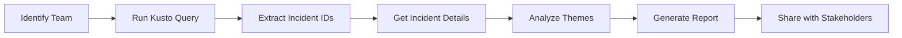

# Purview ICM Analysis Framework

**Purpose**: Systematic analysis of Purview ICM incidents to identify themes, documentation gaps, product improvements, and UX enhancements.

**Owner**: PHE Team (Product Health Engineering)  
**Created**: February 4, 2026  
**Last Updated**: February 4, 2026

---

## 📁 Folder Structure

```
purview_analysis/
├── README.md                  # This file - main instructions
├── queries/                   # Kusto queries for ICM data extraction
│   ├── get_all_teams.kql     # List all Purview teams with incident counts
│   ├── get_team_incidents.kql # Get incidents for specific team
│   └── get_incident_details.kql # Detailed incident information
├── reports/                   # Generated analysis reports (by team)
│   ├── SensitivityLabels/    # Sensitivity Labels team analysis
│   ├── DLPEndpoint/          # DLP Endpoint team analysis
│   └── [TeamName]/           # One folder per team analyzed
├── data/                      # Raw data exports (CSV/JSON)
│   └── [TeamName]_incidents_[date].csv
└── templates/                 # Report templates and frameworks
    ├── analysis_template.md  # Standard report template
    └── theme_categories.md   # Common theme classification
```

---

## 🚀 Quick Start Guide

### Prerequisites

1. **Access Requirements**:
   - ICM MCP Server access (installed and configured)
   - Kusto MCP Server access (icmcluster.kusto.windows.net)
   - Azure authentication configured

2. **Tools Needed**:
   - VS Code with GitHub Copilot
   - PowerShell 7+
   - Python 3.8+ (optional, for data processing)

### Basic Workflow



---

## 📊 Step-by-Step Analysis Process

### Step 1: Identify All Purview Teams

**Query**: `queries/get_all_teams.kql`

```kusto
Incidents
| where CreateDate >= ago(180d)
| where OwningTenantName == "Purview"
| summarize IncidentCount = count() by OwningTeamName
| order by IncidentCount desc
```

**How to Run**:
1. Open terminal in VS Code
2. Ask Copilot: "Run Kusto query from queries/get_all_teams.kql"
3. Review team list and incident counts
4. Select team(s) for analysis

**Output**: List of all Purview teams with total incident counts (last 6 months)

---

### Step 2: Get Incidents for Specific Team

**Query**: `queries/get_team_incidents.kql`

**Parameters**:
- `{TEAM_NAME}`: e.g., "PURVIEW\\SensitivityLabels"
- `{LOOKBACK_DAYS}`: Default 180 (6 months)
- `{CRITERIA}`: "HowFixed == 'By Design' or Title contains 'DCR'"

```kusto
Incidents
| where CreateDate >= ago({LOOKBACK_DAYS}d)
| where OwningTenantName == "Purview"
| where OwningTeamName == "{TEAM_NAME}"
| where {CRITERIA}
| summarize 
    FirstSeen = min(CreateDate),
    LastSeen = max(CreateDate),
    Count = count()
    by IncidentId, Title, HowFixed, Severity, SourceOrigin
| order by Count desc, FirstSeen desc
| take 100
```

**How to Run**:
1. Update parameters in query
2. Ask Copilot: "Run this Kusto query and save results to data/"
3. Review unique incidents (deduplicated)

**Output**: CSV file with deduplicated incident list

---

### Step 3: Analyze Incident Themes

**Process**:
1. Review incident titles and group by common patterns
2. Use template categories (see `templates/theme_categories.md`)
3. Identify:
   - **Product gaps**: Missing functionality customers expect
   - **Documentation gaps**: Features exist but not documented
   - **UX issues**: Confusing or unclear user experience
   - **Consistency issues**: Behavior differs across platforms

**Common Theme Categories**:

| Category | Description | Examples |
|----------|-------------|----------|
| Cross-Platform Inconsistency | Feature works differently in different apps | Outlook vs OWA labeling |
| Platform Support Gaps | Feature missing on specific platform | iOS DKE support |
| Auto-Classification Issues | AI/ML labeling not working as expected | SIT detection accuracy |
| UX/Workflow Friction | User workflow confusing or cumbersome | Justification dialogs |
| API/PowerShell Gaps | Automation capabilities missing | Cmdlet parameters |
| Licensing/Scope Confusion | Unclear what features require what license | Per-device licensing |
| Audit/Reporting Gaps | Missing visibility into operations | Activity Explorer data |
| Integration Issues | Problems with 3rd party or adjacent products | Teams, Power BI integration |

---

### Step 4: Generate Analysis Report

**Template**: `templates/analysis_template.md`

**Required Sections**:
1. **Executive Summary**
   - Total incidents analyzed
   - Key finding (most common theme)
   - % "By Design" vs DCR

2. **Theme Analysis** (for each theme):
   - Priority level (Critical/High/Medium/Low)
   - Incident count
   - Customer pain points (3-5 bullets)
   - Example incidents (3-5 ICM IDs with titles)
   - Root causes (Product/Docs/UX)
   - Recommended actions (P0/P1/P2 items)

3. **Overall Recommendations**:
   - Documentation priorities
   - Product improvements
   - UX enhancements

4. **Success Metrics**
   - How to measure improvement

5. **Next Steps**
   - Immediate actions (30 days)
   - Short-term (90 days)
   - Long-term (6-12 months)

**How to Generate**:
```
Ask Copilot: "Analyze incidents for [TEAM_NAME] and generate report 
using templates/analysis_template.md. Focus on themes, doc gaps, 
product improvements, and UX enhancements."
```

**Output**: Markdown report in `reports/[TeamName]/`

---

## 🔍 Advanced Analysis Techniques

### Correlation Analysis

Find incidents that mention multiple features/areas:

```kusto
Incidents
| where OwningTenantName == "Purview"
| where Title contains "label" and Title contains "encrypt"
| summarize Count = count() by OwningTeamName
```

### Time-Series Analysis

Track incident trends over time:

```kusto
Incidents
| where OwningTenantName == "Purview"
| where OwningTeamName == "PURVIEW\\SensitivityLabels"
| summarize Count = count() by bin(CreateDate, 1d), HowFixed
| order by CreateDate desc
```

### Customer Impact Analysis

Identify high-impact customers:

```kusto
Incidents
| where OwningTenantName == "Purview"
| where CustomerName != ""
| summarize IncidentCount = count() by CustomerName
| order by IncidentCount desc
```

---

## 📋 Report Templates

### Standard Report Structure

```markdown
# [Team Name]: Themes & Improvement Opportunities Report

**Date**: [Current Date]
**Analysis Period**: Last 6 Months
**Team**: [Full Team Path]
**Total Incidents Analyzed**: [Count] ([By Design Count] "By Design", [DCR Count] DCRs)

---

## Executive Summary

[Key findings - 2-3 paragraphs]

---

## Theme Analysis & Recommendations

### 1. [Theme Name]
**Priority**: 🔴 CRITICAL / 🟡 HIGH / 🟠 MEDIUM / 🟢 LOW
**Incident Count**: ~[Number]+ incidents

#### Customer Pain Points:
- [Pain point 1]
- [Pain point 2]
- [Pain point 3]

#### Example Incidents:
- IcM [ID]: "[Title]"
- IcM [ID]: "[Title]"
- IcM [ID]: "[Title]"

#### Root Causes:
1. **Product**: [Description]
2. **Docs**: [Description]
3. **UX**: [Description]

#### Recommended Actions:

**PRODUCT IMPROVEMENTS:**
- [ ] **P0**: [Action item]
- [ ] **P1**: [Action item]
- [ ] **P2**: [Action item]

**DOCUMENTATION FIXES:**
- [ ] **P0**: [Action item]
- [ ] **P1**: [Action item]

**UX IMPROVEMENTS:**
- [ ] **P0**: [Action item]
- [ ] **P1**: [Action item]

---

[Repeat for each theme]

---

## Overall Recommendations by Category

### 📚 Documentation Priorities (P0)
1. [Priority item]
2. [Priority item]

### 🔧 Product Improvements (P0)
1. [Priority item]
2. [Priority item]

### 🎨 UX Improvements (P0)
1. [Priority item]
2. [Priority item]

---

## Success Metrics

1. **Reduction in "By Design" Incidents**: Target [%] reduction
2. **Documentation Usage**: Page views on new docs
3. **Customer Satisfaction**: Survey results
4. **Feature Adoption**: Usage metrics for new features

---

## Next Steps

### Immediate Actions (Next 30 Days):
- [ ] Action item
- [ ] Action item

### Short-Term (90 Days):
- [ ] Action item
- [ ] Action item

### Long-Term (6-12 Months):
- [ ] Action item
- [ ] Action item
```

---

## 🎯 Best Practices

### Analysis Tips

1. **Look for Patterns**: Group similar incidents even if titles differ
2. **Read Between Lines**: "By Design" often means "we need better docs"
3. **Consider UX**: If users file as "bug", UX might be unclear
4. **Check Frequency**: High-count incidents = systemic issues
5. **Cross-Reference**: Look at related teams (e.g., DLP + Labels)

### Common Pitfalls to Avoid

- ❌ **Don't**: Analyze each incident individually
- ✅ **Do**: Group by theme first, then sample incidents

- ❌ **Don't**: Assume "By Design" means working correctly
- ✅ **Do**: Investigate why customers expect different behavior

- ❌ **Don't**: Focus only on product changes
- ✅ **Do**: Balance product, docs, and UX recommendations

- ❌ **Don't**: Use technical jargon in reports
- ✅ **Do**: Use customer language and plain English

### Report Quality Checklist

- [ ] Executive summary is 2-3 paragraphs max
- [ ] Each theme has 3-5 example incidents with IDs
- [ ] Root causes split between Product/Docs/UX
- [ ] Actions prioritized as P0/P1/P2
- [ ] Success metrics are measurable
- [ ] Next steps have timelines
- [ ] Report saved in correct folder
- [ ] Data sources documented in appendix

---

## 🔧 Troubleshooting

### Kusto Query Errors

**Error: "Table not found"**
- Solution: Verify table name with `list_tables` tool
- Common tables: `Incidents`, `IncidentHistory`, `Teams`

**Error: "400 Bad Request"**
- Solution: Check column names in schema
- Use: `get_table_schema` tool first

**Error: "Too many results"**
- Solution: Add `| take 100` or adjust date range

### ICM MCP Server Issues

**Can't get incident details**
- Check incident ID is numeric (no leading zeros)
- Verify ICM access permissions
- Try omnisearch first to verify ID exists

### Report Generation

**Themes aren't clear**
- Read more incident titles to find patterns
- Use broader categories, then subdivide
- Check `templates/theme_categories.md` for ideas

**Too many incidents to analyze**
- Start with top 50 by count
- Focus on recent incidents (last 90 days)
- Filter to "By Design" OR "DCR" only

---

## 📚 Reference Documentation

### Key Resources

- **ICM Portal**: https://portal.microsofticm.com
- **Kusto Cluster**: https://icmcluster.kusto.windows.net
- **Purview Docs**: https://docs.microsoft.com/en-us/purview/
- **ICM Best Practices**: Internal wiki link

### Related Queries

- **IC/MCS Risk Report**: `risk_reports/queries/ic_mcs_risk_report.kql`
- **Support Case Analysis**: `GetSCIMIncidentV2` table queries
- **Farm-Specific Incidents**: Filter by `FarmId` or `FarmLabel`

### Team Contacts

- **Product Health Engineering**: [Distribution list]
- **Purview PM Team**: [Contact info]
- **Purview Docs Team**: [Contact info]

---

## 📈 Analysis Cadence

### Recommended Schedule

| Frequency | Activity | Owner |
|-----------|----------|-------|
| Weekly | Monitor high-priority teams | PHE |
| Monthly | Quick review all teams | PHE |
| Quarterly | Deep-dive analysis per team | PHE + PM |
| Semi-Annual | Comprehensive report all teams | PHE Lead |

### Team Priority Tiers

**Tier 1 (Weekly)**: High incident volume or customer impact
- SensitivityLabels
- DLPEndpoint
- eDiscovery
- Audit

**Tier 2 (Monthly)**: Moderate volume
- Classification
- DLP (Generic)
- InsiderRiskManagement
- CommunicationCompliance

**Tier 3 (Quarterly)**: Lower volume or specialized
- ExactDataMatch (EDM)
- RBAC
- ComplianceManager
- Others

---

## 🤖 Automation Opportunities

### Future Enhancements

1. **Automated Data Collection**
   - Scheduled Kusto queries (weekly)
   - Auto-export to CSV in `data/` folder

2. **Theme Classification ML**
   - Train model on past categorizations
   - Auto-suggest themes for new incidents

3. **Report Generation Bot**
   - Natural language: "Generate report for DLPEndpoint"
   - Auto-populate template with data
   - Schedule monthly reports

4. **Trend Alerts**
   - Notify when incident spike detected
   - Alert on new theme emergence
   - Track "By Design" % changes

---

## 📝 Change Log

| Date | Change | Author |
|------|--------|--------|
| 2026-02-04 | Initial framework created | PHE Team |
| 2026-02-04 | Sensitivity Labels analysis completed | PHE Team |

---

## 🆘 Support

For questions or issues with this framework:

1. Check this README first
2. Review existing reports in `reports/` for examples
3. Contact PHE team via [channel/email]
4. File issue in [tracking system]

---

**Happy Analyzing! 🎉**
