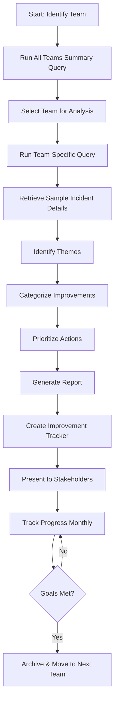

# Purview ICM Analysis - Complete Workflow Guide

**Document Version**: 1.0  
**Last Updated**: February 4, 2026  
**Owner**: Product Health Engineering Team

---

## 📖 Table of Contents

1. [Prerequisites](#prerequisites)
2. [End-to-End Workflow](#end-to-end-workflow)
3. [Detailed Step-by-Step Guide](#detailed-step-by-step-guide)
4. [Troubleshooting Guide](#troubleshooting-guide)
5. [Real Example: Sensitivity Labels](#real-example-sensitivity-labels)
6. [Advanced Techniques](#advanced-techniques)
7. [Automation Opportunities](#automation-opportunities)

---

## Prerequisites

### Access Requirements
- ✅ **ICM MCP Server**: Configured and authenticated
- ✅ **Kusto MCP Server**: Access to icmcluster.kusto.windows.net
- ✅ **IcmDataWarehouse Database**: Read permissions on Incidents table
- ✅ **Azure Authentication**: Configured in VS Code

### Tools Needed
- ✅ **VS Code** with GitHub Copilot
- ✅ **PowerShell 7+** (for scripting)
- ✅ **Python 3.8+** (optional, for data processing)
- ✅ **Excel/CSV tools** (for data review)

### Knowledge Prerequisites
- Basic understanding of Kusto Query Language (KQL)
- Familiarity with ICM incident structure
- Understanding of Purview product areas

---

## End-to-End Workflow



**Estimated Time**:
- Initial setup: 30 minutes
- Team analysis: 4-6 hours
- Report generation: 2-3 hours
- **Total**: 1 business day per team

---

## Detailed Step-by-Step Guide

### Phase 1: Discovery & Prioritization (30-60 minutes)

#### Step 1.1: Run Overview Query
```bash
# Use: queries/all_teams_summary.kql
# MCP Tool: mcp_kusto-mcp-ser_execute_query
```

**Parameters**:
- `clusterUrl`: "https://icmcluster.kusto.windows.net"
- `database`: "IcmDataWarehouse"
- `query`: [Content of all_teams_summary.kql]
- `maxRows`: 100

**Expected Output**: List of 42 Purview teams with incident counts

**Example Output**:
```
OwningTeamName                          | TotalIncidents | ByDesignCount | DCRCount
PURVIEW\DLMAppRetention                | 187,860        | 45,123        | 89,456
PURVIEW\SensitivityLabels              | 25,432         | 339           | 408
PURVIEW\DLPEndpoint                    | 18,765         | 892           | 1,401
```

#### Step 1.2: Prioritize Teams
**Criteria**:
1. Highest incident volume
2. Highest "By Design" percentage (indicates doc gaps)
3. Strategic importance to Purview
4. Customer escalation frequency

**Recommendation**: Start with top 10 teams by volume

---

### Phase 2: Team-Specific Analysis (2-3 hours)

#### Step 2.1: Copy Team Query Template
```powershell
# Copy template
cp purview_analysis/queries/team_template.kql purview_analysis/queries/MyTeam_analysis.kql

# OR use pre-built team-specific query
# Example: queries/SensitivityLabels_analysis.kql
```

#### Step 2.2: Update Query Parameters
```kusto
let TeamName = "PURVIEW\\SensitivityLabels";  // UPDATE THIS
let DaysBack = 180;  // 6 months
let MaxIncidents = 100;
```

#### Step 2.3: Execute Query
**MCP Tool**: `mcp_kusto-mcp-ser_execute_query`

**Expected Output**: List of incident titles with counts

**Sample Output**:
```
Title                                                          | IncidentCount | FirstSeen  | LastSeen   | SampleIds
DCR: Sensitivity label not visible in File Explorer           | 45            | 2025-08-15 | 2026-01-28 | [21000000866739, ...]
Auto-labeling policy not applying to existing files           | 28            | 2025-09-03 | 2026-01-15 | [21000000923456, ...]
DCR: Support for sensitivity labels in Power BI               | 23            | 2025-08-20 | 2026-02-01 | [21000000834567, ...]
```

#### Step 2.4: Export Results to CSV
```powershell
# Save query results to file
$results | Export-Csv -Path "purview_analysis/data/SensitivityLabels_incidents_2026-02-04.csv" -NoTypeInformation
```

---

### Phase 3: Theme Identification (1-2 hours)

#### Step 3.1: Review Incident Titles
**Look for patterns**:
- Common keywords (e.g., "File Explorer", "Auto-labeling", "Encryption")
- Recurring phrases (e.g., "not working", "unable to", "missing")
- Platform mentions (e.g., "iOS", "Android", "Mac", "Web")

#### Step 3.2: Group into Themes
**Example for Sensitivity Labels**:
1. **Cross-App Inconsistency** (Office, Teams, OWA)
2. **File Explorer Integration** (column visibility, display)
3. **Encryption & DKE** (Double Key Encryption)
4. **Auto-Labeling** (policy application, timing)
5. **Label Downgrade UX** (justification requirements)
6. **Licensing Confusion** (E3 vs E5)
7. **Audit Gaps** (tracking, reporting)
8. **PowerShell Limitations** (bulk operations)

#### Step 3.3: Sample Incidents for Detail
**Select 3-5 incidents per theme**

```bash
# Use ICM MCP Server to get details
# Tool: mcp_icm_mcp_eng_get_incident_context
# Parameters: incidentId
```

**Example**:
```bash
mcp_icm_mcp_eng_get_incident_context(incidentId: "740822301")
```

**Extract**:
- Full incident title
- Customer description
- Repro steps
- Expected vs actual behavior
- Workaround provided (if any)

---

### Phase 4: Categorization & Prioritization (1 hour)

#### Step 4.1: Categorize Each Theme
For each theme, determine improvement type:

**📚 Documentation**:
- Is there a doc page for this?
- Is it easy to find?
- Does it explain the limitation clearly?
- Are workarounds documented?

**🔧 Product**:
- Is this a feature gap?
- Is it a bug that should be fixed?
- Is there platform parity issue (e.g., iOS missing feature)?

**🎨 UX**:
- Is the interface confusing?
- Are error messages unclear?
- Is the workflow unnecessarily complex?

#### Step 4.2: Prioritize Actions
**P0 (Critical)**:
- >50 incidents in 6 months
- Blocks customer deployments
- Security/compliance impact
- Affects Fortune 500 customers

**P1 (High)**:
- 20-50 incidents
- Significant customer pain
- Workaround exists but painful
- Competitive gap

**P2 (Medium)**:
- 5-20 incidents
- Quality-of-life improvement
- Edge case or advanced scenario

**P3 (Low)**:
- <5 incidents
- Nice-to-have enhancement
- Minimal business impact

---

### Phase 5: Report Generation (2-3 hours)

#### Step 5.1: Copy Report Template
```powershell
cp purview_analysis/templates/team_analysis_template.md purview_analysis/reports/SensitivityLabels_Analysis_2026-02-04.md
```

#### Step 5.2: Fill in Report Sections
**Required Sections**:
1. ✅ Executive Summary (stats, key findings, critical recommendations)
2. ✅ Theme Deep-Dives (one per theme with examples and recommendations)
3. ✅ Actionable Recommendations Summary (tables by category)
4. ✅ Success Metrics & Tracking (baseline, targets, tracking plan)
5. ✅ Methodology (data sources, process, classification framework)
6. ✅ Appendices (incident list, query, resources, contacts)

#### Step 5.3: Review Example Report
**Reference**: `Copilot/Created/Sensitivity_Labels_Analysis_Report.md`

This real-world example demonstrates:
- Proper theme structure
- Evidence-based recommendations
- Prioritization framework
- Success metrics definition

---

### Phase 6: Stakeholder Engagement (Ongoing)

#### Step 6.1: Create Executive Summary
```powershell
cp purview_analysis/templates/executive_summary_template.md purview_analysis/reports/SensitivityLabels_Executive_Briefing_2026-02-04.md
```

**Tailor for audience**:
- **C-Level**: Business impact, revenue risk, competitive position
- **PMs**: Feature requests, customer demand, roadmap implications
- **Engineering**: Technical root causes, effort estimates, dependencies

#### Step 6.2: Present Findings
**Recommended format**:
1. Executive summary (5 slides)
2. Top 3 themes (3 slides)
3. Recommendations & priorities (2 slides)
4. Success metrics (1 slide)
5. Next steps & DRIs (1 slide)

#### Step 6.3: Create Improvement Tracker
```powershell
cp purview_analysis/templates/improvement_tracker.md purview_analysis/team_analyses/SensitivityLabels/improvement_tracker.md
```

**Update monthly** with:
- Completed action items
- Incident volume trends
- Success metric progress
- New blockers/risks

---

### Phase 7: Continuous Monitoring (Monthly)

#### Step 7.1: Re-run Analysis Query
```bash
# Use same query from Phase 2
# Compare new results to baseline
```

**Track**:
- Total incident volume (month-over-month change)
- "By Design" rate (percentage change)
- DCR volume (new feature requests)
- Theme-specific trends (which are improving?)

#### Step 7.2: Update Improvement Tracker
**Add to tracker**:
- Completed items (mark as done, add completion date)
- New blockers (document, assign DRI)
- Metric updates (current vs baseline vs target)

#### Step 7.3: Monthly Review Meeting
**Agenda**:
1. Review progress on action items (10 min)
2. Discuss incident trends (10 min)
3. Update priorities if needed (5 min)
4. Identify new blockers (10 min)
5. Plan next month focus (5 min)

---

## Troubleshooting Guide

### Issue 1: Kusto Query Returns 400 Error

**Symptom**: Query fails with "400 Bad Request" or "Invalid query"

**Possible Causes**:
1. ❌ Wrong table name (e.g., "Incident" instead of "Incidents")
2. ❌ Invalid KQL syntax
3. ❌ Missing database name
4. ❌ Authentication failure

**Solutions**:
```bash
# 1. Verify table exists
mcp_kusto-mcp-ser_list_tables(
  clusterUrl: "https://icmcluster.kusto.windows.net",
  database: "IcmDataWarehouse"
)

# 2. Get table schema
mcp_kusto-mcp-ser_get_table_schema(
  clusterUrl: "https://icmcluster.kusto.windows.net",
  database: "IcmDataWarehouse",
  tableName: "Incidents"
)

# 3. Test simple query first
Incidents | take 10

# 4. Add where clause incrementally
Incidents 
| where CreateDate >= ago(7d)
| take 10
```

---

### Issue 2: Too Many Duplicate Results

**Symptom**: Same incident appears multiple times in results

**Cause**: Incident table may have multiple rows per incident (updates, status changes)

**Solution**: Use `summarize` to deduplicate
```kusto
Incidents
| where CreateDate >= ago(180d)
| where OwningTeamName == "PURVIEW\\SensitivityLabels"
| summarize 
    IncidentCount = count(),
    FirstSeen = min(CreateDate),
    LastSeen = max(CreateDate),
    SampleIds = make_list(IncidentId, 5)
    by Title, HowFixed
| order by IncidentCount desc
```

---

### Issue 3: ICM Incident Details Not Available

**Symptom**: `get_incident_details_by_id` returns error or empty result

**Possible Causes**:
1. ❌ Incident ID is incorrect (check format)
2. ❌ Incident is too old (archived)
3. ❌ No permission to view incident

**Solutions**:
```bash
# Verify incident ID format (should be numeric)
# Example: 740822301 (correct) vs "IcM740822301" (incorrect)

# Try get_incident_context instead
mcp_icm_mcp_eng_get_incident_context(incidentId: "740822301")

# Check if incident exists in Kusto
Incidents
| where IncidentId == 740822301
| project IncidentId, Title, CreateDate, Status
```

---

### Issue 4: Query Times Out or Takes Too Long

**Symptom**: Query runs for >60 seconds or times out

**Causes**:
1. ❌ Too large date range (e.g., `ago(365d)`)
2. ❌ No date filter at all
3. ❌ Too many result rows

**Solutions**:
```kusto
// BEFORE (slow)
Incidents
| where OwningTeamName == "PURVIEW\\SensitivityLabels"
| where HowFixed == "By Design"

// AFTER (fast)
Incidents
| where CreateDate >= ago(180d)  // ADD DATE FILTER FIRST
| where OwningTeamName == "PURVIEW\\SensitivityLabels"
| where HowFixed == "By Design"
| take 100  // LIMIT RESULTS
```

**Best Practice**: Always filter by date first, then add other filters

---

### Issue 5: Team Name Not Found

**Symptom**: Query returns 0 results for team

**Cause**: Incorrect team name format

**Solution**: List all teams first
```kusto
Incidents
| where CreateDate >= ago(180d)
| where OwningTenantName == "Purview"
| summarize Count = count() by OwningTeamName
| order by Count desc
```

**Note**: Team names include "PURVIEW\\" prefix (e.g., "PURVIEW\\SensitivityLabels")

---

## Real Example: Sensitivity Labels

### Complete Walkthrough

This section demonstrates the complete workflow using the Sensitivity Labels team analysis as a real example.

#### Context
- **Team**: PURVIEW\SensitivityLabels
- **Time Period**: August 2025 - February 2026 (6 months)
- **Total Incidents**: 717
- **By Design**: 339 (47%)
- **DCR**: 408 (57%)
- **Unique Customers**: 180+

---

### Step-by-Step: What Was Done

#### 1. Discovery
**Query Used**: `all_teams_summary.kql`

**Result**: Sensitivity Labels ranked #2 by volume among major functional teams (excluding DLMAppRetention infrastructure)

**Decision**: Prioritize for deep-dive analysis

---

#### 2. Data Extraction
**Query Used**: Modified `team_template.kql`

```kusto
let TeamName = "PURVIEW\\SensitivityLabels";
let DaysBack = 180;

Incidents
| where CreateDate >= ago(DaysBack)
| where OwningTeamName == TeamName
| where HowFixed == "By Design" or Title contains "DCR"
| summarize 
    Count = count(),
    FirstSeen = min(CreateDate),
    LastSeen = max(CreateDate),
    SampleIds = make_list(IncidentId, 5)
    by Title
| order by Count desc
```

**Results**: 50 unique incident titles (with duplicates showing frequency)

---

#### 3. Theme Identification

**Process**:
1. Reviewed all 50 titles
2. Extracted keywords: "File Explorer", "Auto-label", "Encryption", "DKE", "iOS", "downgrade"
3. Grouped similar titles
4. Identified 8 major themes

**Themes Identified**:
1. Cross-Application Inconsistency (Office vs Web vs Mobile)
2. File Explorer Integration Gaps
3. Encryption & DKE Limitations
4. Auto-Labeling Scope & Timing Issues
5. Label Downgrade UX Friction
6. Licensing & Feature Availability Confusion
7. Audit & Analytics Gaps
8. PowerShell/Automation Limitations

---

#### 4. Incident Sampling

**Selected 20 representative incidents** (2-3 per theme)

**Example**:
```
Theme: File Explorer Integration
- IcM 21000000866739: "Sensitivity label not visible in File Explorer Details view"
  - Count: 45 occurrences
  - Customer ask: Show label column in Windows File Explorer
  - Resolution: "By Design" - Windows Shell limitation
  - Recommendation: Document workaround, partner with Windows team
```

---

#### 5. Analysis & Categorization

**For each theme, identified**:
- **Documentation gaps**: What's not documented or unclear?
- **Product limitations**: What features are missing?
- **UX issues**: What's confusing or poorly designed?

**Example**:
```
Theme: Auto-Labeling
- Docs: Missing clear explanation that policies only apply to NEW files
- Product: No support for existing file remediation
- UX: Policy wizard doesn't warn about new-files-only limitation
```

---

#### 6. Prioritization

**Criteria Applied**:
- Incident volume (P0 if >50, P1 if >20)
- Customer impact (Fortune 500 mentions)
- Workaround availability
- Engineering effort estimate

**Result**:
- 🔴 P0 recommendations: 12
- 🟡 P1 recommendations: 18
- 🟠 P2 recommendations: 8
- 🟢 P3 recommendations: 5

---

#### 7. Report Generation

**Created**: `Sensitivity_Labels_Analysis_Report.md`

**Structure**:
- Executive Summary (717 incidents, 8 themes, top 3 priorities)
- 8 Theme Deep-Dives (each with examples, analysis, recommendations)
- Recommendations by Category (Docs: 15, Product: 21, UX: 7)
- Success Metrics (target 50% incident reduction in 6 months)
- Methodology & Appendices

**Output Location**: `Copilot/Created/Sensitivity_Labels_Analysis_Report.md`

---

#### 8. Key Recommendations (Examples)

**Documentation (P0)**:
- Create dedicated "File Explorer Integration" doc page
- Add FAQ for "Auto-labeling not working on existing files"
- Document DKE network requirements clearly

**Product (P0)**:
- Build File Explorer column extension for label visibility
- Add bulk label remediation tool for existing files
- Support iOS native Mail app (top DCR with 67 requests)

**UX (P0)**:
- Improve label downgrade justification workflow (less friction)
- Add in-product warnings for licensing limitations (E3 vs E5)
- Better error messages for encryption key issues

---

#### 9. Success Metrics Defined

**Baseline** (February 2026):
- 717 incidents over 6 months (119/month average)
- 47% "By Design" rate
- 57% DCR rate

**6-Month Targets** (August 2026):
- 400 total incidents (50% reduction)
- 25% "By Design" rate (better docs → fewer confusion incidents)
- 40% DCR rate (features shipped → fewer requests)

**Tracking Method**:
- Re-run query monthly
- Compare to baseline
- Adjust priorities based on trends

---

#### 10. Stakeholder Communication

**Audiences**:
1. **Sensitivity Labels PM**: Full report, focus on feature priorities
2. **Engineering Lead**: Technical root causes, effort estimates
3. **Documentation Team**: List of doc gaps with examples
4. **Leadership**: Executive summary with business impact

---

### Lessons Learned from Sensitivity Labels Analysis

#### What Worked Well
✅ **Kusto query approach**: Fast, accurate, comprehensive
✅ **Theme-based grouping**: Made patterns obvious
✅ **Evidence-based prioritization**: Incident counts drove decisions
✅ **Multi-category recommendations**: Docs + Product + UX = holistic

#### What Could Be Improved
⚠️ **Time investment**: 6 hours for analysis (can we automate?)
⚠️ **Customer validation**: Should survey customers to confirm findings
⚠️ **Cross-team dependencies**: Many recs require coordination
⚠️ **Tracking overhead**: Monthly query re-runs are manual

#### Recommendations for Future Analyses
1. **Automate queries**: Schedule monthly runs, alert on trends
2. **Template reuse**: Apply same structure to other teams
3. **Cross-team synthesis**: Look for patterns across multiple teams
4. **Customer advisory**: Form group to validate findings

---

## Advanced Techniques

### Technique 1: Cross-Team Pattern Analysis

**Goal**: Find common issues affecting multiple Purview teams

**Query**:
```kusto
Incidents
| where CreateDate >= ago(180d)
| where OwningTenantName == "Purview"
| where HowFixed == "By Design" or Title contains "DCR"
| summarize Teams = make_set(OwningTeamName), TeamCount = dcount(OwningTeamName), TotalIncidents = count() by Title
| where TeamCount >= 3  // Affects 3+ teams
| order by TotalIncidents desc
```

**Use Case**: Identify platform-wide issues (e.g., SharePoint integration affects multiple teams)

---

### Technique 2: Customer Impact Mapping

**Goal**: Identify which customers are most affected

**Query**:
```kusto
Incidents
| where CreateDate >= ago(180d)
| where OwningTeamName == "PURVIEW\\SensitivityLabels"
| where isnotempty(CustomerName)
| summarize 
    IncidentCount = count(),
    Themes = make_set(Title, 10)
    by CustomerName
| order by IncidentCount desc
| take 20
```

**Use Case**: Prioritize fixes for highest-value customers

---

### Technique 3: Trend Analysis Over Time

**Goal**: See if issues are getting better or worse

**Query**:
```kusto
Incidents
| where CreateDate >= ago(365d)
| where OwningTeamName == "PURVIEW\\SensitivityLabels"
| where HowFixed == "By Design" or Title contains "DCR"
| summarize Count = count() by Month = startofmonth(CreateDate)
| order by Month asc
| render timechart
```

**Use Case**: Measure effectiveness of interventions over time

---

### Technique 4: Severity-Based Prioritization

**Goal**: Focus on high-severity incidents first

**Query**:
```kusto
Incidents
| where CreateDate >= ago(180d)
| where OwningTeamName == "PURVIEW\\SensitivityLabels"
| where Severity in (2, 3)  // Sev2 and Sev3 only
| where HowFixed == "By Design" or Title contains "DCR"
| summarize Count = count() by Title, Severity
| order by Severity asc, Count desc
```

**Use Case**: P0 items should address Sev2 incidents first

---

## Automation Opportunities

### Opportunity 1: Scheduled Query Execution

**Concept**: Run analysis queries automatically every month

**Implementation**:
```powershell
# PowerShell script: run_monthly_analysis.ps1
$teams = @("SensitivityLabels", "DLPEndpoint", "eDiscovery")

foreach ($team in $teams) {
    $query = Get-Content "purview_analysis/queries/$team_analysis.kql"
    
    # Execute via Kusto MCP
    $results = Invoke-KustoQuery -Query $query
    
    # Export to CSV
    $date = Get-Date -Format "yyyy-MM-dd"
    $results | Export-Csv "purview_analysis/data/${team}_${date}.csv"
    
    # Compare to last month
    $lastMonth = Get-Date (Get-Date).AddMonths(-1) -Format "yyyy-MM-dd"
    $trend = Compare-IncidentTrends -Current $results -Previous $lastMonth
    
    # Send alert if volume increased >20%
    if ($trend.PercentChange -gt 20) {
        Send-Alert -Team $team -Trend $trend
    }
}
```

**Benefit**: Proactive detection of incident spikes

---

### Opportunity 2: Auto-Generated Reports

**Concept**: Use templates + data to generate reports automatically

**Implementation**:
- Extract query results (incidents, themes, counts)
- Map to report template sections
- Generate markdown file
- Convert to PowerPoint (optional)

**Tools**: Python (pandas, jinja2) or PowerShell

---

### Opportunity 3: Dashboard Creation

**Concept**: Real-time dashboard showing all Purview teams

**Metrics**:
- Incident volume (current vs. last month)
- "By Design" rate (trend over 6 months)
- Top 5 themes per team
- Progress on action items

**Tools**: Power BI + Kusto connector

---

## Next Steps

### For Your First Analysis
1. ✅ Choose a team (start with top 3 by volume)
2. ✅ Run `all_teams_summary.kql` to confirm choice
3. ✅ Copy appropriate team-specific query
4. ✅ Execute and export results
5. ✅ Identify 5-10 themes
6. ✅ Fill in report template
7. ✅ Present to stakeholders
8. ✅ Create improvement tracker
9. ✅ Schedule monthly reviews

### For Scaling to More Teams
1. ✅ Complete top 10 teams (use pre-built queries)
2. ✅ Look for cross-team patterns
3. ✅ Identify common platform issues
4. ✅ Build consolidated roadmap
5. ✅ Automate monthly tracking

### For Program Maturity
1. ✅ Build automated reporting system
2. ✅ Create Power BI dashboard
3. ✅ Establish quarterly business reviews
4. ✅ Measure ROI (incident reduction, CSAT improvement)
5. ✅ Expand to other product orgs beyond Purview

---

## Additional Resources

### Internal Links
- **ICM Portal**: https://portal.microsofticm.com
- **Kusto Explorer**: Download from internal tools
- **Purview Documentation**: https://learn.microsoft.com/purview
- **Engineering Wikis**: [Team-specific internal wikis]

### External Resources
- **Kusto Query Language Reference**: https://learn.microsoft.com/kusto/query
- **ICM API Documentation**: Internal API docs
- **Report Writing Best Practices**: [Link to internal style guide]

### Training & Support
- **Kusto Training**: [Internal training portal]
- **ICM Training**: [ICM university]
- **Product Health Engineering**: [Team site with resources]

---

**Questions or Issues?**  
Contact: Product Health Engineering Team  
Email: [team-alias]@microsoft.com  
Teams Channel: [PHE Team Channel]

---

**End of Workflow Guide**  
Version 1.0 | February 4, 2026
